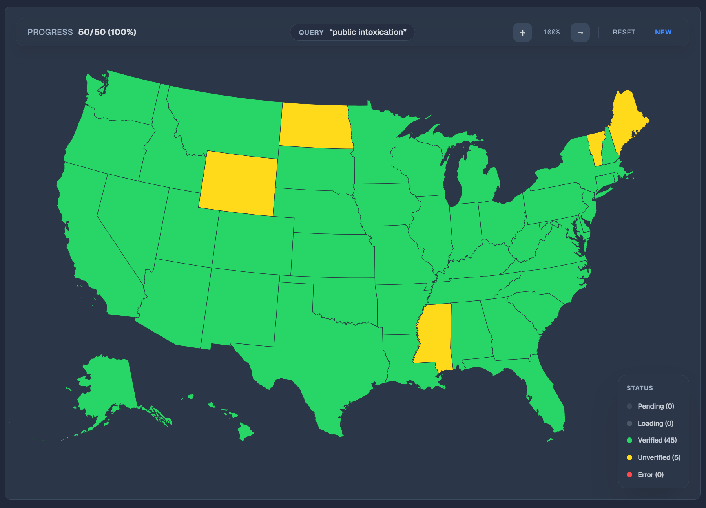

# Lawvics: The 50-State Autonomous Legal Research Engine

> **"A parallelized, swarm-intelligence system for real-time statutory analysis."**

Lawvics is a Next.js-based autonomous agent platform designed to perform simultaneous legal research across all 50 US states. It orchestrates a "swarm" of AI agents to retrieve, verify, and visualize jurisdiction-specific statutes in real-time, preventing hallucinations through rigorous schema validation.



## 🚀 Core Features

### 1. Swarm Orchestration
Unlike traditional sequential search, Lawvics utilizes an **Orchestrator Agent** that manages 50 concurrent asynchronous jobs.
- **Parallel Processing**: Fetches data for all 50 states simultaneously (or in configurable batches).
- **Rate Limit Management**: Intelligent chunking and inter-chunk delays to respect API limits.
- **Optimistic UI**: Real-time map updates (Loading -> Success/Error) provide immediate feedback.

### 2. The Auditor (Anti-Hallucination)
Trust is paramount in legal tech. Lawvics employs a dedicated **Auditor Agent** that verifies every piece of incoming data.
- **Schema Validation**: Enforces strict Zod schemas for all statute data.
- **Citation Check**: Verifies that the citation format matches the jurisdiction's standard.
- **Trust Scoring**: Assigns a `trustLevel` ('verified', 'suspicious', 'unverified') and `confidenceScore` to each result.

### 3. Multi-Provider AI Support
Flexible "Bring Your Own Key" (BYOK) architecture supporting multiple AI backends:
- **OpenAI**: GPT-4o / GPT-4-Turbo
- **Google Gemini**: Gemini 1.5 Pro / Flash
- **OpenRouter**: Access to infinite models (Claude 3.5 Sonnet, Llama 3, etc.) via a unified interface. Defaults to OpenAI GPT-4o Mini.

### 4. Interactive Visualization
- **Data-Driven Map**: A D3.js powered map that color-codes states based on research results (e.g., "Verification Failed", "Strict Limitation", "Liberal Limitation").
- **Matrix View**: A high-density table view for comparing statutes side-by-side.

## 🛠️ Tech Stack

### Frontend & Framework
*   **Next.js 16 (App Router)**: The React framework for the web.
*   **React 19**: Utilizing the latest concurrent features.
*   **Tailwind CSS v4**: Utility-first CSS framework for rapid UI development.
*   **Framer Motion**: Smooth, complex animations for the "swarm" effect.
*   **Shadcn/ui**: Accessible, re-usable component primitives.

### State & Logic
*   **Zustand**: Lightweight global state management for the swarm processing pipeline.
*   **TanStack Query**: Async state management for API interactions.
*   **Zod**: TypeScript-first schema declaration and validation.
*   **Vercel AI SDK**: Standardized interface for LLM interactions.

### Visualization
*   **React Simple Maps**: Declarative map components.
*   **D3-Scale**: Quantitative scales for data visualization.

## 🏗️ Architecture

### Data Flow Lifecycle

1.  **User Query**: User inputs a legal question (e.g., "Statute of limitations for fraud").
2.  **Orchestration (`src/lib/agents/orchestrator.ts`)**:
    *   The **Translator Agent** converts the natural language query into 50 jurisdiction-specific search terms.
    *   The **Swarm Manager** initializes 50 async jobs.
    *   Requests are processed in batches (default chunk size: 2) to manage load.
3.  **Retrieval Modes**:
    *   **LLM Scraper**: Uses AI to parse search results (requires API key).
    *   **Official APIs**: Connects to OpenStates or Legiscan (if configured).
    *   **Mock Mode**: Chaos engineering simulation for development (see below).
4.  **Verification (`src/lib/agents/auditor.ts`)**:
    *   Raw data is passed to the **Auditor Agent**.
    *   Checks: `is_link_valid`, `citation_format`, `repeal_check`.
    *   Result: Validated `Statute` object is committed to the Zustand store.
5.  **Visualization**:
    *   Store updates trigger re-renders in the `USMap` and `StatuteDetailPanel`.

## 💻 Getting Started

### Prerequisites
*   Node.js 18+
*   npm or pnpm

### Installation

1.  **Clone the repository**
    ```bash
    git clone https://github.com/andymsun/lawvics.git
    cd lawvics
    ```

2.  **Install dependencies**
    ```bash
    npm install
    # or
    pnpm install
    ```

3.  **Run Development Server**
    ```bash
    npm run dev
    ```
    Open [http://localhost:3000](http://localhost:3000) to view the app.

## 🧪 Development Modes

### Mock Mode (Chaos Engineering)
By default, the app runs in **Mock Mode** if no API keys are provided. This is designed for testing system resilience.
*   **Random Latency**: Simulates real-world network vagaries (800ms - 2500ms).
*   **Random Failures**: 20% chance of 500/Timeout errors to test error handling UI.
*   **Suspicious Data**: 15% chance of returning "hallucinated" or malformed data to test the Auditor.

### Demo Queries
The system recognizes specific queries to trigger pre-canned, perfectly structured demo flows for presentation purposes:
*   *"Adverse Possession"*
*   *"Statute of limitations for fraud"*
*   *"Grand theft felony threshold"*

## 📂 Project Structure

```
src/
├── app/                  # Next.js App Router pages
├── components/
│   ├── map/              # Map visualization components
│   ├── dashboard/        # Main analytical views
│   └── ui/               # Shared UI components
├── data/                 # Static data & demo mocks
├── lib/
│   ├── agents/           # AI Logic (Orchestrator, Auditor)
│   ├── stores/           # Zustand state stores
│   └── utils.ts          # Helper functions
└── types/                # TypeScript interfaces
```

---

Built with ❤️ by the Lawvics Team. We got this!
